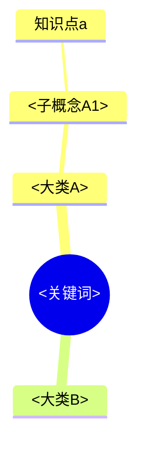

# Topic Storm Builder

把任意关键词/主题变成 `E:\obsidian\<主题>\` 下的一套**"先总后细"的分层知识库**，流程 = **发散（多视角）→ 细化（逐类深挖）→ 建库（写文件）**。本 Skill 是豆包（Doubao/MainAgent）侧的完整工作流规范，直接在本机执行，不依赖 OpenClaw。

## 触发与前置判断

收到建库请求后：
1. 提取主题关键词（保留原文用词：英文小写、中文原样）。
2. **意图澄清（P0，强制）**：检测关键信息是否充分，不足则先反问 1-3 个高价值问题（附"为什么问"），不猜、不直接建库：
   - 这个主题想达到什么目的？（入门科普 / 系统深入 / 备考应考 / 简历素材）
   - 期望建到多细？（概念总览 / 到知识点 / 到实践+资源）
   - `E:\obsidian` 下是否已建过相关库？（增量 or 新建）
   - 若用户已给足信息则跳过反问。
3. **查已有库（P0）**：扫描 `E:\obsidian\` 根目录，若已存在同名/相似主题 → 提示用户增量补充 or 另建（默认增量）。
4. 用户确认"开始/确认"后才进入发散。

## 阶段 A：STORM 多视角发散

对主题跑 **5 个默认视角**，产出多角度分类框架（这是"分类更细致全面、更多元发散"的关键）：
- practitioner 从业者视角
- researcher 研究者视角
- skeptic 怀疑者视角
- economic observer 经济观察者视角
- historical observer 历史观察者视角

每个视角产出一行：`核心关注 | 支持什么 | 挑战什么 | 独特信息 | 需验证`。然后：
- 构建**矛盾图**：直接冲突、共识、最强证据、最弱证据、盲点。
- 产出**知识大类树**（缩进树形，先总后细，后续所有产物的统一骨架）：
  ```
  <关键词>
  ├── 01-<大类A>
  │   ├── <子概念A1>
  │   └── <子概念A2>
  ├── 02-<大类B>
  └── ...
  ```
- 大类一般 6-10 个，覆盖主题的"认知/院校/科目/理论/实践/工具/就业/规划"等通用维度，并按主题动态调整。
- **发散必须围绕关键词**：每个大类都要能回答"和这个关键词什么关系"，不做无关扩散。
- **大类清单确认关卡（P0，强制）**：发散完成后，**必须先向用户完整展示知识大类树**，并请用户确认/增删/调序，收到"确认/开始"才进入阶段 B。不得未经确认直接细化。若用户只说"随便/你定"则按当前清单推进。

## 阶段 B：深度研究逐类细化

对每个知识大类（或用户指定优先的类）执行细化：
1. 每类生成 **2-3 个不同角度的搜索查询**（覆盖定义/历史/原理/分类/实践/资源）。
2. 用本机搜索工具逐路检索（串行调用，避免反爬限流；**不要并行发起多路**，遇限流隔几十秒重试一次）。
3. 优先一手官方来源 > 权威媒体 > 分析师估算；每条关键事实记录来源 URL。
4. 每类产出结论，至少包含：
   - 核心发现（3-5 条）
   - 定量数据（有则给：指标 | 来源 | 年份）
   - 洞察（跨来源推断，格式 "[A]+[B]→[C]"）
   - 意外发现/争议（≤2 条）
   - 信息缺口（标注"待补充"）
5. **逐类推进**，一类完成后再做下一类；重要大类先做。
6. **每类结论先展示再继续（P0）**：每细化完一个大类，先在对话中展示该类的核心发现/数据/洞察（400-600 字），并提示用户"继续下一类 / 调整方向 / 跳过某类"；用户确认后再推进，避免闷头做完才发现方向不对。

## 阶段 C：Obsidian 建库

### 目录结构（在 `E:\obsidian\<主题>\` 下）
```
<主题>\
├── _知识谱系.md             # 全库总谱系图（Mermaid mindmap，先总：一图览全貌）
├── _MOC.md                  # 总索引 + 学习路线图（必建）
├── _log.md                  # 增量日志（append-only，必建）
├── 01-<大类A>\
│   ├── _总览.md             # 该类子谱系 + 知识点索引（先总）
│   ├── <知识点1>.md
│   └── <知识点2>.md
├── 02-<大类B>\
│   └── ...
```

### 核心原则（与既有 obsidian 建库 skill 一致）
1. **文件直写**：Vault 是纯 Markdown 文件夹，直接用文件工具操作 `E:\obsidian\`，不依赖 Obsidian App/插件。
2. **每个主题 = 独立 vault**：路径固定 `E:\obsidian\<主题>\`，不与其他主题混用路径。
3. **先总后细**：先产出知识谱系树 → 生成 `_知识谱系.md`（Mermaid mindmap）与每大类 `_总览.md`（子谱系 + 索引）→ 知识点笔记为最细层。
4. **带引用**：每篇笔记保留来源 URL，绝不编造；拿不准标注"待核实"。
5. **增量生长**：已有库时复用目录，只补新笔记并更新谱系/总览/_log。
6. **写后回读校验**：每批写入后回读抽查（文件存在、frontmatter 闭合、Mermaid/wikilink 语法、无乱码），发现问题就地修复。

### 笔记模板（每篇统一）
```markdown
---
tags: [<关键词>, <分类>]
source: [<来源URL1>, <来源URL2>]
created: YYYY-MM-DD
status: draft
---

# <标题>

## 一句话概括
...

## 核心内容
- ...

## 要点 / 例子
- ...

## 相关链接
- [来源1](<url>)

## 关联笔记
[[_MOC]]
```

### 大类的 _总览.md 模板
```markdown
# <分类> 总览

## 子谱系


## 知识点索引
- [[知识点1]] —— 一句话
- [[知识点2]]

## 推荐学习顺序
1. ...
```

### _知识谱系.md（Mermaid mindmap）


## 红线
1. 只允许在 `E:\obsidian\` 下创建/修改文件；禁止触碰其他磁盘目录。
2. 写文件前检查目标是否存在：已存在则 append 或同目录新建带后缀的笔记，禁止覆盖已有笔记。
3. 所有事实与来源必须来自搜索结果；拿不准标注"待核实"。
4. 不删除任何已有笔记。
5. `_log.md` 只追加、不覆盖。

## 汇报
建库完成后：给出知识库路径、全库谱系图与目录结构、推荐学习顺序；提示用户可指定子话题继续细化（增量生长）。
